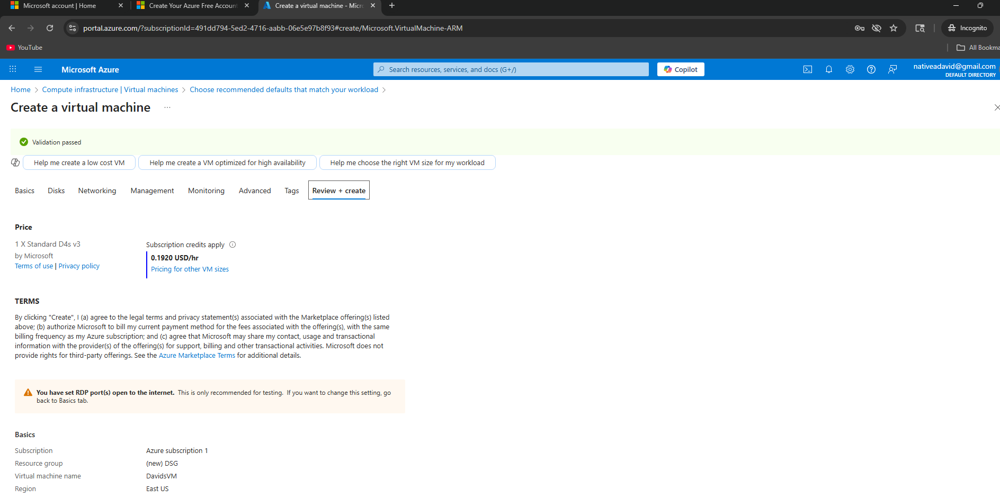
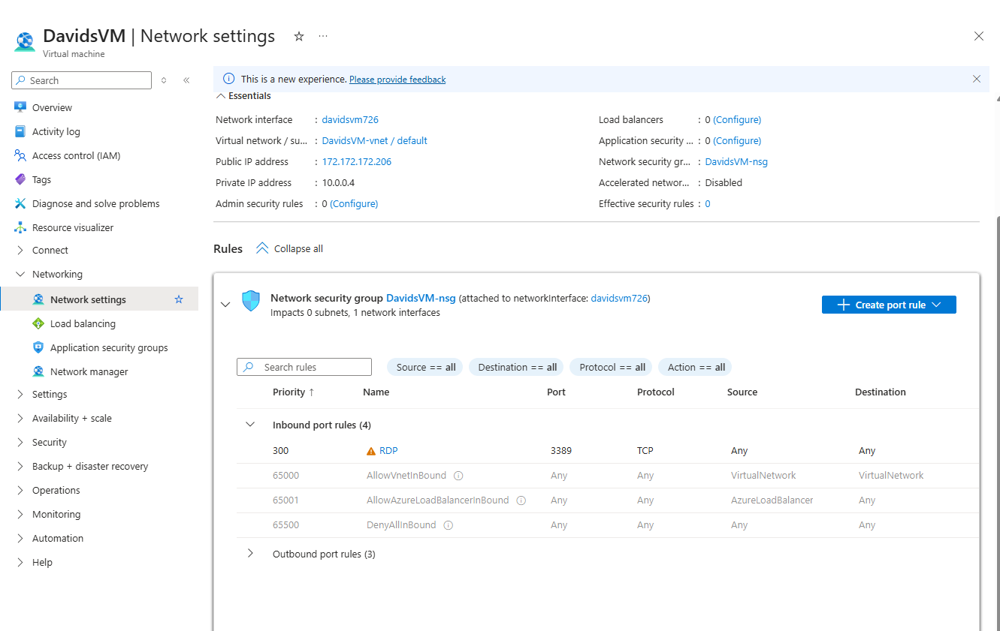
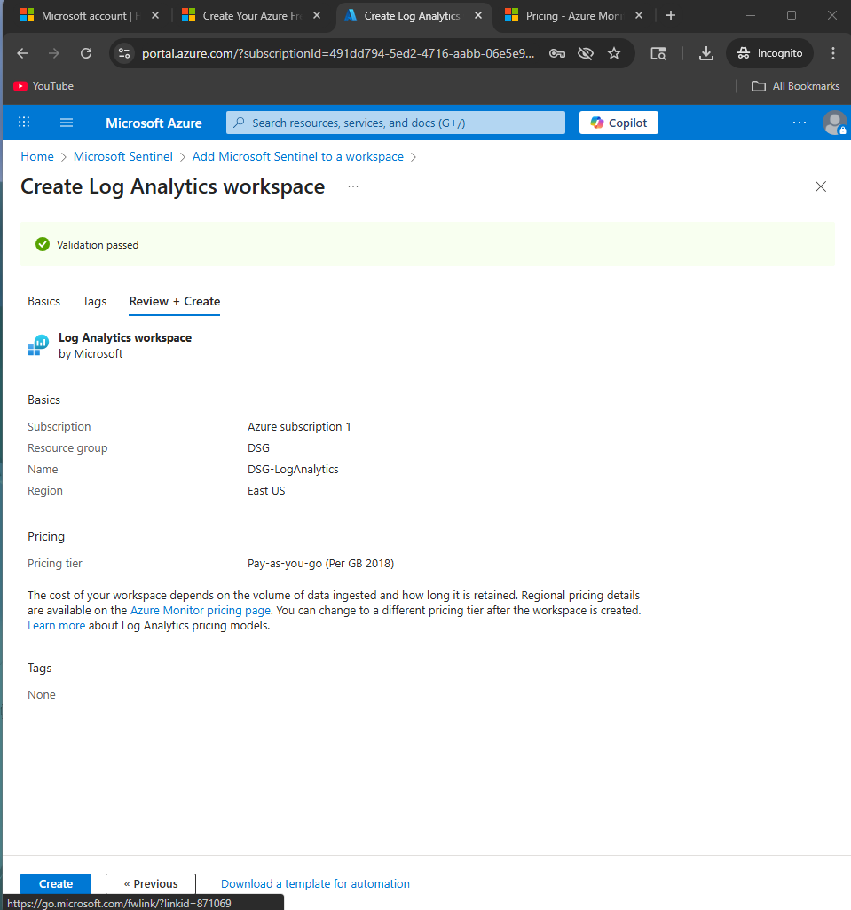
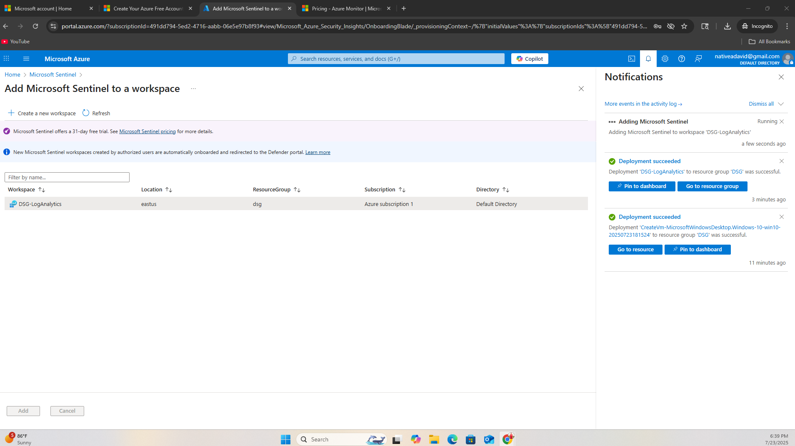
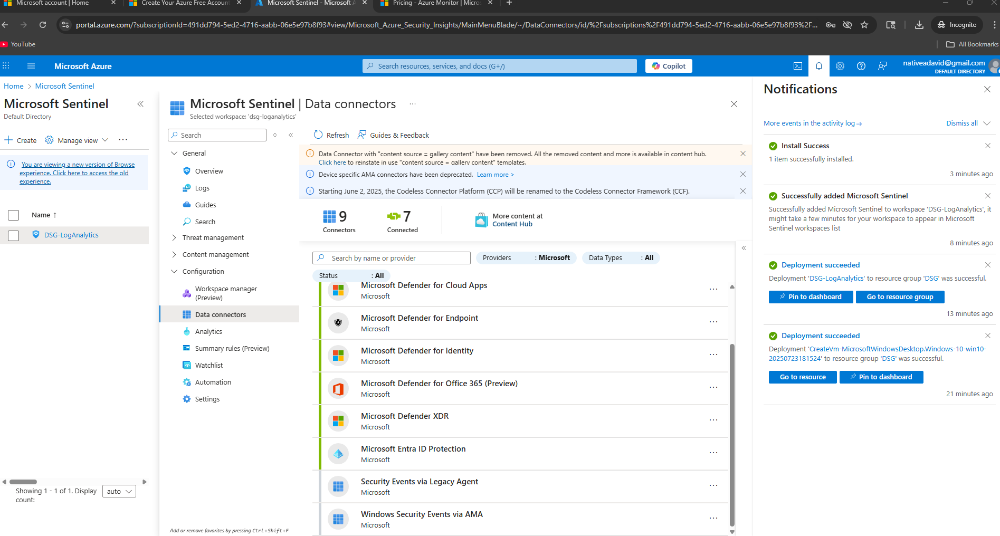
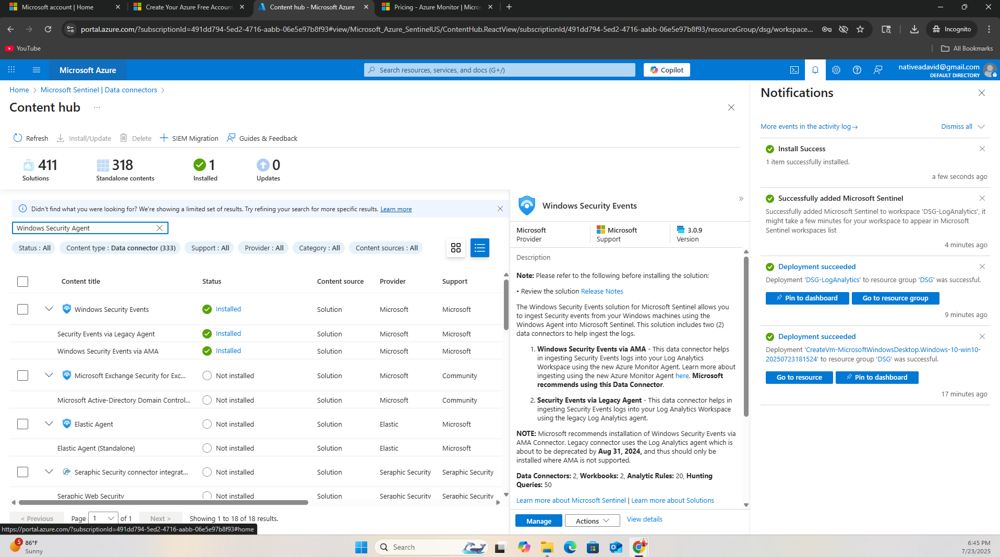
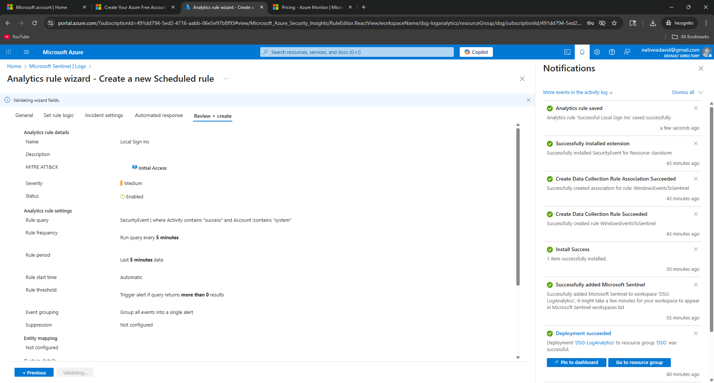
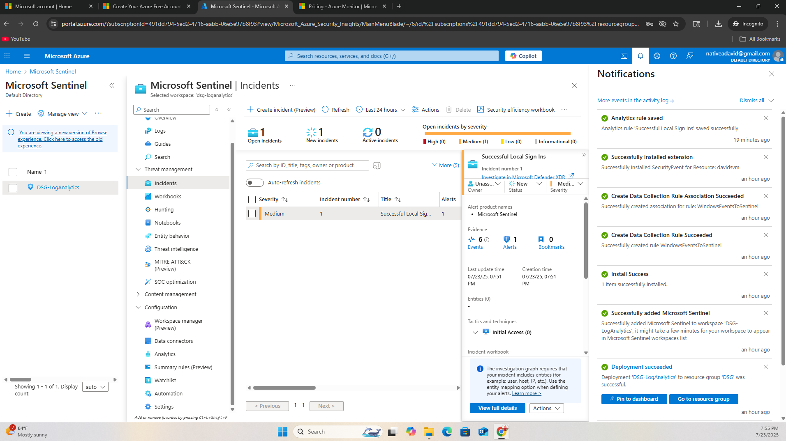

# Azure Sentinel RDP Detection Lab

This project simulates a basic SOC  detection pipeline by configuring Microsoft Sentinel to monitor a Windows 10 Pro virtual machine for RDP login activity.

## Tools & Services Used

- Microsoft Azure (Free Trial)
- Windows 10 Pro Virtual Machine (Azure)
- Microsoft Sentinel (SIEM)
- Log Analytics Workspace
- Data Connectors (Windows Security Events)
- Kusto Query Language (KQL)

## Setup Process

### 1. VM Creation

- Created a new Azure VM using the Windows 10 Pro image.
- Enabled RDP.
- Left all other settings at default.

  


### 2. Deploying Microsoft Sentinel

- Created a Log Analytics Workspace.
- Installed Microsoft Sentinel into the workspace.

  


### 3. Ingesting Logs

- Added Windows Security Events via the Data Connectors tab.
- Installed the required monitoring agent on the VM.
- Created a Data Collection Rule to route logs to the Log Analytics Workspace.

  


### 4. Writing Detection Rule

- Created a Scheduled Analytics Rule to detect successful RDP logins from accounts other than SYSTEM using this custom KQL query:

```kql
SecurityEvent
| where Activity contains "success" and Account !contains "system"
```



### 5. Triggering the Detection

- Signed in to the Azure VM using RDP from another machine.
- The successful login event matched the custom detection rule.

### 6. Incident Generation

- Microsoft Sentinel triggered an incident based on the detection rule.
- The incident appeared under the "Incidents" tab, containing evidence and metadata for investigation.



## Outcome

This lab demonstrated how to:

- Set up and configure Microsoft Sentinel with a Log Analytics Workspace  
- Ingest and monitor Windows Security Events from an Azure VM  
- Write a KQL detection rule to catch successful logins  
- Trigger and view incidents automatically through Sentinel
