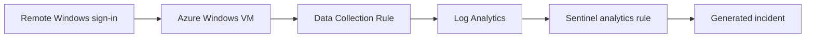

# Microsoft Sentinel RDP Detection Lab

An evidence-backed detection-engineering lab that sends Windows Security Events from an Azure VM into Microsoft Sentinel, applies KQL analytics logic, and validates that a matching sign-in produces an incident.

> **Scope:** Controlled lab environment. This is not a production detection and does not claim production coverage, tuning, or response automation.

## What I built


```mermaid
flowchart LR
    R[Remote Windows sign-in] --> V[Azure Windows VM]
    V --> D[Data Collection Rule]
    D --> L[Log Analytics]
    L --> S[Sentinel analytics rule]
    S --> I[Generated incident]
```

| Stage | Evidence |
| --- | --- |
| Windows VM deployed | [VM deployment](screenshots/VM_Deployment_Review.png) |
| RDP network rule enabled | [VM network rules](screenshots/VM_Network_Rules_RDP_Enabled.png) |
| Log Analytics workspace created | [Workspace](screenshots/Log_Analytics_Workspace_Created.png) |
| Microsoft Sentinel enabled | [Sentinel workspace](screenshots/Sentinel_Workspace_Added.png) |
| Windows Security Events connected | [Data connector](screenshots/Sentinel_Data_Connectors.png) and [monitoring extension](screenshots/Windows_Security_Events_Installed.png) |
| Scheduled analytics rule created | [Analytics rule](screenshots/Sentinel_Scheduled_Rule.png) |
| Incident generated after a test sign-in | [Triggered incident](screenshots/Sentinel_Incident_Triggered.png) |

## Detection objective

Identify successful Remote Desktop logons to the monitored Windows VM while excluding built-in service identities. The Windows event of interest is successful logon event **4624** with **Logon Type 10**, which represents a remote interactive session.

## Detection logic

### Version used in the original lab

The first scheduled rule used this proof-of-concept query:

```kql
SecurityEvent
| where Activity contains "success" and Account !contains "system"
```

That query successfully generated the incident shown in the evidence, but it is broader than the stated RDP objective. It can match successful non-RDP activity and relies on a text field instead of the specific event and logon type.

### Refined RDP-specific query

This is the narrower logic that should be deployed and revalidated in a second lab run:

```kql
SecurityEvent
| where EventID == 4624
| where LogonType == 10
| where Account !in~ ("SYSTEM", "LOCAL SERVICE", "NETWORK SERVICE")
| project
    TimeGenerated,
    Computer,
    Account,
    IpAddress,
    WorkstationName,
    LogonType,
    EventID,
    Activity
| order by TimeGenerated desc
```

The refined query is documented separately from the original evidence so the repository does not imply that an unvalidated revision produced the existing screenshot.

## Implementation

1. Deployed a Windows 10 Pro Azure VM.
2. Enabled Remote Desktop access for the controlled test environment.
3. Created a Log Analytics workspace and added Microsoft Sentinel.
4. Connected Windows Security Events and associated the VM through a data collection rule.
5. Created a scheduled analytics rule using KQL.
6. Signed in remotely to generate a matching Windows event.
7. Confirmed that Sentinel created an incident containing the matching evidence.

## Analyst validation checklist

For a new alert or incident:

1. Confirm `EventID == 4624` and `LogonType == 10`.
2. Identify the destination computer and target account.
3. Review the source IP and workstation name.
4. Determine whether the account, source, and time are expected.
5. Check for repeated failed logons before the successful session.
6. Review nearby process-creation, privilege-assignment, and account-change events.
7. Escalate when the source, account, timing, or follow-on activity cannot be explained.

## Tuning and false positives

A successful RDP logon is not automatically malicious. Expected administrator activity, help-desk access, jump hosts, maintenance windows, and approved remote-support tools can generate legitimate matches.

Production tuning would require:

- Approved administrator and jump-host allowlists.
- A defined observation window and alert threshold.
- Correlation with failed logons and subsequent privileged activity.
- Asset criticality and identity context.
- Documented suppression and review procedures.

## MITRE ATT&CK context

The observed behavior is most directly associated with **Remote Services: Remote Desktop Protocol (T1021.001)**. A confirmed compromise using a legitimate account could also involve **Valid Accounts (T1078)**, but a successful logon by itself does not prove either malicious intent or account compromise.

## Limitations

- The original query was not specific enough to prove RDP-only detection.
- The refined query is documented but still needs a fresh deployment and incident screenshot.
- The lab used a single endpoint and one controlled validation event.
- No automated enrichment, containment, or ticketing workflow was implemented.
- No measured false-positive rate or long-term baseline exists.
- The screenshots show the original Azure account interface and should be sanitized before reuse in public presentations.

## Skills demonstrated

- Azure VM and Log Analytics configuration
- Windows Security Event ingestion
- Microsoft Sentinel analytics rules and incident generation
- KQL detection logic
- Evidence-based validation
- Detection limitations, tuning, and analyst triage documentation

## Next validation run

1. Deploy the refined query.
2. Generate one expected and one unexpected RDP session.
3. Capture the matching event fields and resulting Sentinel incident.
4. Confirm that a normal local interactive logon does not match.
5. Add a second query correlating failed logons with a later successful RDP session.
